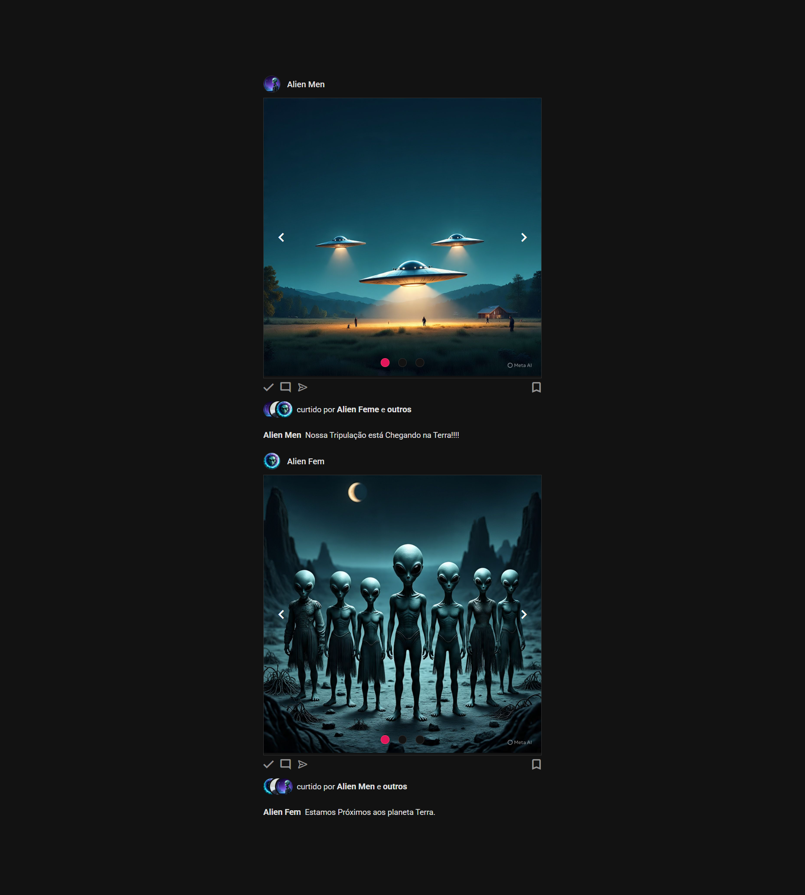

# 📸 Instagram Clone - SSG Frontend  

Este projeto é uma aplicação desenvolvida com a abordagem **SSG (Static Site Generation)**, onde o conteúdo é pré-renderizado em tempo de build, gerando páginas estáticas rápidas e otimizadas.  

O objetivo foi simular a interface de postagens do Instagram, trazendo exemplos criativos de interação e exibição de posts com imagens.  

---

## 🚀 Tecnologias Utilizadas
- **Angular** (para construção do front-end)  
- **SSG (Static Site Generation)**  
- **HTML5 / CSS3**  
- **TypeScript**  

---

## ⚡ Benefícios do SSG
- Maior **desempenho** e **escalabilidade** do site.  
- Melhor **SEO**, pois os mecanismos de busca conseguem indexar conteúdo pré-renderizado facilmente.  
- Redução do tempo de carregamento das páginas.  

---

## 📷 Demonstração  

Aqui está um exemplo de como a aplicação renderiza os posts:  

  

---

## 🔧 Como Rodar o Projeto

```bash
# Clone o repositório
git clone https://github.com/seu-usuario/seu-repositorio.git

# Entre na pasta do projeto
cd seu-repositorio

# Instale as dependências
npm install

# Rode em ambiente de desenvolvimento
npm start

# Gerar build estática
npm run build
